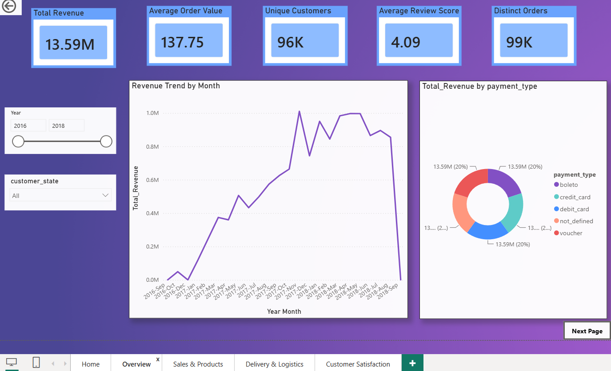
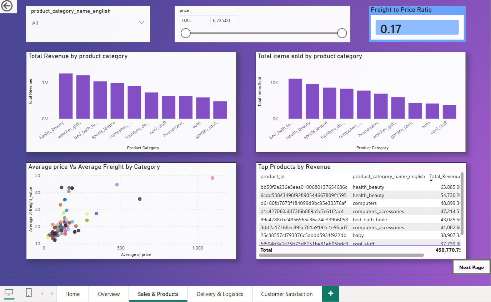
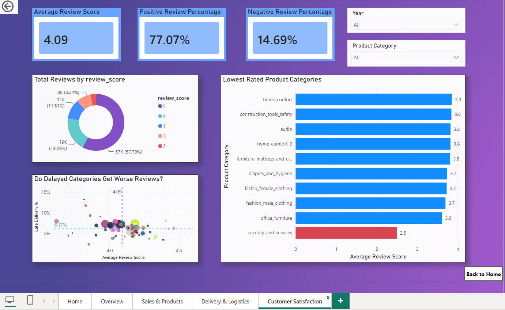
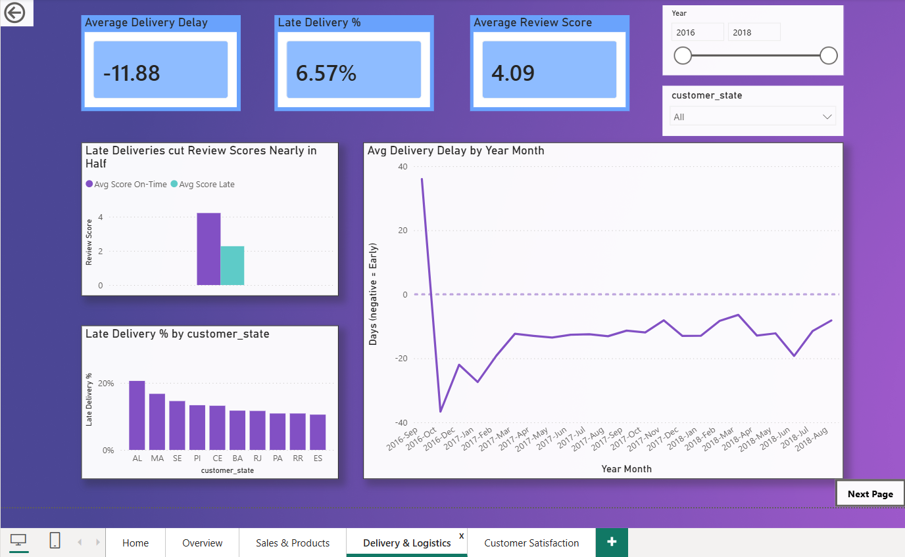

# 🛒 Brazilian E-Commerce Analytics – Power BI

An interactive Power BI dashboard built using the Brazilian E-Commerce Public Dataset to analyze sales performance, customer behavior, product performance, payment methods, reviews, and delivery logistics.

---

## 📊 Project Overview

This project analyzes Brazilian e-commerce transactions to identify important business trends and provide actionable insights through interactive Power BI dashboards.

The analysis focuses on:

- Sales and revenue performance
- Customer behavior
- Product and category performance
- Order trends
- Payment methods
- Customer satisfaction
- Delivery and logistics performance

---

## 🎯 Business Objectives

- Analyze overall sales and order performance
- Identify high-performing product categories
- Understand customer purchasing behavior
- Analyze customer satisfaction using review scores
- Evaluate payment method usage
- Measure delivery and logistics performance
- Identify trends that can support business decision-making

---

## 🗂️ Dataset

**Dataset:** Brazilian E-Commerce Public Dataset by Olist

The dataset contains information about orders placed through an online marketplace in Brazil.

The project uses multiple related tables, including:

- Customers
- Orders
- Order Items
- Order Payments
- Order Reviews
- Products

---

## 🧹 Data Preparation

Data preparation was performed using **Power Query**.

Key steps included:

- Removing unnecessary columns
- Handling missing and blank values
- Correcting data types
- Cleaning and transforming categorical data
- Creating calculated columns
- Merging related datasets
- Preparing data for analysis and visualization

---

## 🔗 Data Modeling

A relational data model was created in Power BI to connect the different datasets.

The model was designed to support efficient analysis of:

- Orders
- Customers
- Products
- Payments
- Reviews
- Delivery performance

---

## 🧮 DAX

DAX measures were created to calculate important business KPIs and support interactive analysis.

Examples include:

- Total Revenue
- Total Orders
- Total Customers
- Average Order Value
- Average Review Score
- Delivery Performance
- Sales by Category
- Monthly Sales

---

## 📈 Dashboard Pages

### 1. Overview

Provides a high-level view of the overall e-commerce performance, including key KPIs and sales trends.



---

### 2. Sales & Products Analysis

Analyzes sales performance across product categories and identifies top-performing products.



---

### 3. Customer Satisfaction Analysis

Analyzes customer reviews and satisfaction levels using review scores and related metrics.



---

### 4. Delivery & Logistics Analysis

Analyzes order delivery performance and logistics-related trends.



---

## 💡 Key Insights

The dashboard enables analysis of:

- Revenue and order trends over time
- Top-performing product categories
- Customer satisfaction and review patterns
- Payment method preferences
- Delivery performance
- Geographic and customer-level patterns

---

## 🛠️ Tools & Technologies

- **Power BI**
- **Power Query**
- **DAX**
- **Data Modeling**
- **Data Visualization**
- **Excel / CSV**

---

## 📂 Project Structure

```text
Brazilian-Ecommerce-PowerBI/
│
├── PowerBI/
│   └── Brazalian_e-commerce.pbix
│
├── Screenshots/
│   ├── Overview.png
│   ├── Sales_Products_analysis.png
│   ├── Customer_Satisfaction_analysis.png
│   └── Delivery_Logistics_analysis.png
│
├── .gitattributes
└── README.md
